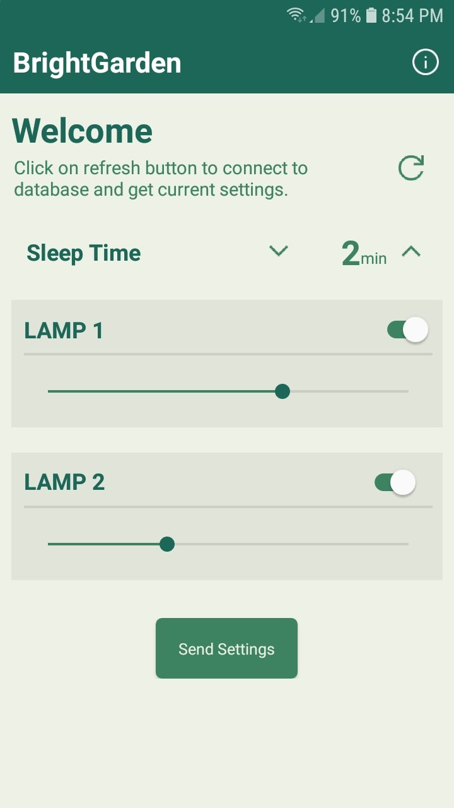

# BrightGarden

BrighGarden is a project that combines IoT (Internet of Things) technology and artificial lighting to support optimal plant growth. This solution includes a mobile application developed in MIT AppInventor for lighting configuration and system control. Additionally, a firmware has been implemented for the ESP32 to manage the LED lamps connected to the system.

## App Screenshot

## Features
- Customizable lighting brightness.
- Customizable lighting schedule.
- Secure communication between the mobile application and ESP32 through Firebase using end-to-end AES128 encryption.
- Deep sleep mode for energy saving.

## License
This project is licensed under the [MIT License](LICENSE).
